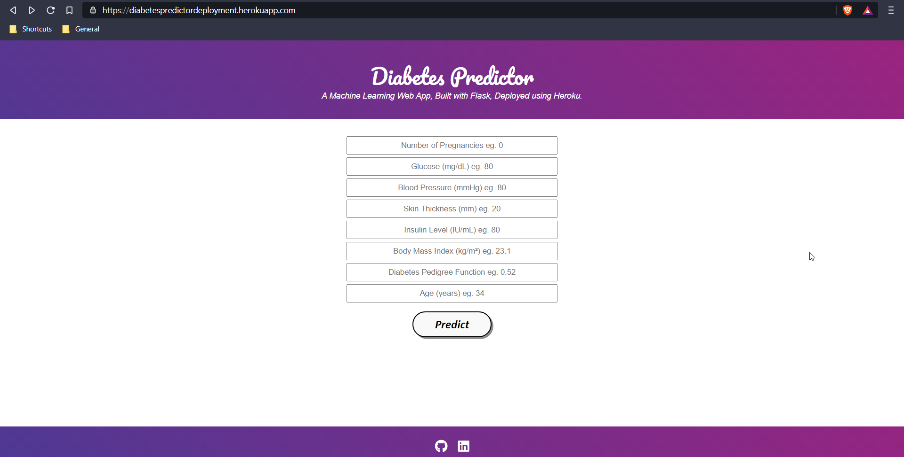

This machine learning project walks through step by step process of how to build a 'DIABETES PREDICTION' model, With deployment.
This ML model asks you few questions such as “Glucose level, Blood Pressure, Skin thickness, Insulin Level, BMI, Age, etc”. to predict whether you have diabetes or not.  

WEB APP URL : https://diabetespredictordeployment.herokuapp.com/

### During model building we have covered almost all data science concepts such as:
1. Import Libraries
2. Load Data
3. Data Preparation
4. Model Building.
5. Model Evaluation
6. Interpreting the ML Model
7. Making Predictions with the Model
8. Saving the Model (as .pkl file)
9. Creating a Web application.
10. Deployment of the application.
### Technology and tools this project covers:
1. Python as a programming language.
2. HTML, CSS & Flask for building Web pages.
3. Numpy and Pandas for data cleaning.
4. Matplotlib & seaborn for data visualization.
5. scikit-learn for exploring the data, & Model Evalution.
6. RandomForestClassifier for model building.
7. pickle 
8. Flask 
9. Heroku (PaaS)
10. Jupyter notebook, Spyder as IDE.
* All the steps required to execute the project have been mentioned in the .ipynb file.
### WEB APP

### CREDITS
Special thanks to Mr.Anuj Vyas as he has created this amazing project initially using a kaggle problem statement and uploaded with a wonderful explanation on his Github.
